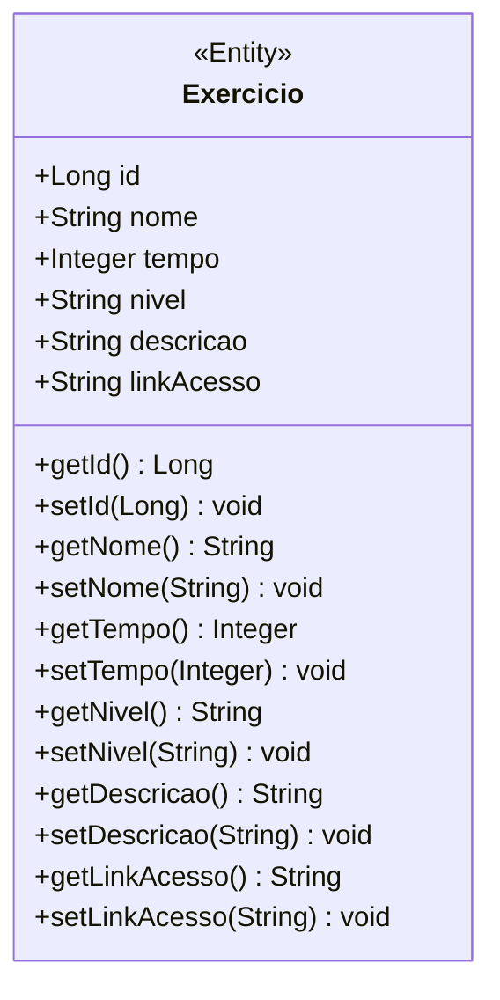

# Yoga Flow - Backend

<br />

<div align="center">
    
</div>


<br /><br />

## 1. Descrição

O Yoga Flow é um aplicativo de fitness personalizado que oferece uma base sólida, acessível e escalável, com uma API segura para integrar diferentes serviços. Sua proposta é ser uma solução completa para quem deseja praticar Yoga e Pilates de chão, unindo atividade física, bem-estar e saúde mental de forma autônoma, em qualquer lugar e horário.

------

## 2. Sobre esta API

A API do Yoga Flow oferece uma solução segura e escalável para integrar práticas de Yoga e Pilates de chão a diferentes plataformas. Voltada ao bem-estar físico e mental, permite personalizar exercícios por tipo, duração (30 a 45 minutos) e nível (iniciante ao avançado), com suporte a vídeo e áudio. Ideal para promover saúde e autonomia em qualquer lugar e horário.

### 2.1. Principais Funcionalidades

O sistema permite:

- Escolha do tipo de exercício conforme preferência do usuário.
- Controle de tempo com práticas entre 30 a 45 minutos.
- Classificação por nível (iniciante, intermediário e avançado).
- Recursos multimídia, como acompanhamento por vídeo e áudio, garantindo acessibilidade e melhor experiência de prática.

------

## 3. Diagrama de Classes

Importando o Projeto

1. Clone o repositório do Projeto [Fitness](https://github.com/CodeQueensjava83/fitness-backend) dentro da pasta do *Workspace* do Eclipse/STS

```bash
git clone https://github.com/CodeQueensjava83/fitness-backend
```

2. **Abra o Eclipse/STS** e selecione a pasta do *Workspace* onde você clonou o repositório do projeto
3. No menu superior do Eclipse/STS, clique na opção: **File 🡲 Import...**
4. Na janela **Import**, selecione a opção: **General 🡲 Existing Projects into Workspace** e clique no botão **Next**
5. Na janela **Import Projects**, no item **Select root directory**, clique no botão **Browse...** e selecione a pasta do Workspace onde você clonou o repositório do projeto
6. O Eclipse/STS reconhecerá automaticamente o projeto
7. Marque o Projeto Conta Bancária no item **Projects** e clique no botão **Finish** para concluir a importação

<br />

### 6.2. Executando o projeto

1. Na guia **Package Explorer**, localize o Projeto Conta Bancária
2. Abra a **Classe Menu**
3. Clique no botão **Run**  para executar a aplicação
4. Caso seja perguntado qual é o tipo do projeto, selecione a opção **Java Application**
5. O console exibirá o menu do Projeto.

<br />


<br />
------

## 4. Diagrama Entidade-Relacionamento (DER)

Adicione a imagem do DER

<div align="center">
    
</div>

------

## 5. Tecnologias utilizadas

| Item                          | Descrição       |
| ----------------------------- | ----------------|
| **Servidor**                  | Apache Tomcat   |
| **Linguagem de programação**  | Java            |
| **Framework**                 | SpringBoot      |
| **ORM**                       | JPA + Hibernate |
| **Banco de dados Relacional** | MySQL           |

------

## 6. Configuração e Execução

Importando o Projeto

1. Clone o repositório do Projeto [Yoga Flow](https://github.com/CodeQueensjava83/fitness-backend) dentro da pasta do *Workspace* do Eclipse/STS

```bash
git clone https://github.com/CodeQueensjava83/fitness-backend
```

2. **Abra o Eclipse/STS** e selecione a pasta do *Workspace* onde você clonou o repositório do projeto
3. No menu superior do Eclipse/STS, clique na opção: **File 🡲 Import...**
4. Na janela **Import**, selecione a opção: **General 🡲 Existing Projects into Workspace** e clique no botão **Next**
5. Na janela **Import Projects**, no item **Select root directory**, clique no botão **Browse...** e selecione a pasta do Workspace onde você clonou o repositório do projeto
6. O Eclipse/STS reconhecerá automaticamente o projeto
7. Marque o Projeto Conta Bancária no item **Projects** e clique no botão **Finish** para concluir a importação

<br />

Executando o projeto

1. Na guia **Package Explorer**, localize o Projeto Conta Bancária
2. Abra a **Classe Menu**
3. Clique no botão **Run**  para executar a aplicação
4. Caso seja perguntado qual é o tipo do projeto, selecione a opção **Java Application**
5. O console exibirá o menu do Projeto.

<br />

##  7. Contato

<br />

Desenvolvido por [**CodeQueens**](https://github.com/CodeQueensjava83)
- Carina Bentlin
- Luana Borghetti Vicaria
- Maria Medeiros
- Milena Svitras
- Myriam Liston Ferreira Perdiza
- Rafaela Imiani

- grupob.turmajava83@gmail.com
Para dúvidas, sugestões ou colaborações, entre em contato via GitHub ou abra uma issue!
